```mermaid
erDiagram
    USERS {
        serial id PK
        varchar name
        varchar username UK
        varchar password
        enum position
        enum job
        boolean is_active
        timestamp created_at
        timestamp updated_at
    }

    UTILITY_PROFILE {
        serial id PK
        varchar section
        varchar title
        text description
        varchar photo_url
        integer sort_order
    }

    JOB_DESCRIPTIONS {
        serial id PK
        enum job_type
        varchar title
        text description
        integer sort_order
    }

    MACHINES {
        serial id PK
        varchar name UK
        enum job_type
        text description
        varchar photo_url
    }

    SCHEDULES {
        serial id PK
        date schedule_date
        enum shift
        integer member_id FK
        enum job
        integer created_by FK
    }

    CHECKLIST_TEMPLATES {
        serial id PK
        enum category
        varchar parameter_name
        enum parameter_type
        varchar unit
        decimal min_value
        decimal max_value
        integer sort_order
    }

    CHECKLIST_ENTRIES {
        serial id PK
        enum category
        date entry_date
        enum shift
        integer machine_id FK
        integer input_by FK
        text notes
    }

    CHECKLIST_VALUES {
        serial id PK
        integer entry_id FK
        integer template_id FK
        varchar parameter_value
        varchar photo_url
    }

    WARNINGS {
        serial id PK
        date warning_date
        enum machine_name
        text description
        varchar photo_url
        text repair_notes
        decimal repair_percentage
        enum status
        integer input_by FK
    }

    WARNING_MEMBERS {
        serial id PK
        integer warning_id FK
        integer member_id FK
    }

    WORKS {
        serial id PK
        date work_date
        varchar area
        text description
        varchar photo_url
        text repair_notes
        decimal repair_percentage
        enum status
        integer input_by FK
    }

    WORK_MEMBERS {
        serial id PK
        integer work_id FK
        integer member_id FK
    }

    SPAREPARTS {
        serial id PK
        date request_date
        varchar item_name
        text specification
        integer quantity
        enum category
        enum urgency
        varchar photo_url
        enum progress
        integer input_by FK
    }

    INVENTORY_ITEMS {
        serial id PK
        enum category
        varchar item_name
        text specification
        integer quantity
        varchar photo_url
    }

    WORKING_INSTRUCTIONS {
        serial id PK
        varchar title
        enum job_type
        text related_machines
        varchar file_url
        text description
        integer uploaded_by FK
    }

    GALLERY_PHOTOS {
        serial id PK
        varchar title
        varchar photo_url
        text caption
        integer uploaded_by FK
    }

    ACTIVITY_LOGS {
        serial id PK
        enum activity_type
        integer reference_id
        varchar reference_table
        integer member_id FK
        enum shift
        enum job
        text description
        date activity_date
        timestamp activity_time
    }

    FILE_UPLOADS {
        serial id PK
        varchar original_name
        varchar file_url
        varchar file_type
        varchar related_table
        integer related_id
        integer uploaded_by FK
    }

    %% RELATIONSHIPS
    USERS ||--o{ SCHEDULES : "creates"
    USERS ||--o{ SCHEDULES : "assigned"
    USERS ||--o{ CHECKLIST_ENTRIES : "submits"
    USERS ||--o{ WARNINGS : "inputs"
    USERS ||--o{ WORKS : "inputs"
    USERS ||--o{ SPAREPARTS : "requests"
    USERS ||--o{ WORKING_INSTRUCTIONS : "uploads"
    USERS ||--o{ GALLERY_PHOTOS : "uploads"
    USERS ||--o{ ACTIVITY_LOGS : "generates"
    USERS ||--o{ FILE_UPLOADS : "uploads"

    MACHINES ||--o{ CHECKLIST_ENTRIES : "monitored"

    CHECKLIST_TEMPLATES ||--o{ CHECKLIST_VALUES : "defines"
    CHECKLIST_ENTRIES ||--o{ CHECKLIST_VALUES : "contains"

    WARNINGS ||--o{ WARNING_MEMBERS : "assigned_to"
    USERS ||--o{ WARNING_MEMBERS : "works_on"

    WORKS ||--o{ WORK_MEMBERS : "assigned_to"
    USERS ||--o{ WORK_MEMBERS : "works_on"
```

# =====================================================
# ERD DIAGRAM - Mermaid Format
# Utility Management Webapp
# =====================================================

# =====================================================
# Paste this into mermaid.live for visual ERD
# =====================================================

# =====================================================
# HOW TO USE
# =====================================================
# 1. Copy the mermaid code above
# 2. Go to https://mermaid.live
# 3. Paste the code
# 4. The ERD diagram will be generated automatically
# 5. You can export as PNG/SVG
# =====================================================
